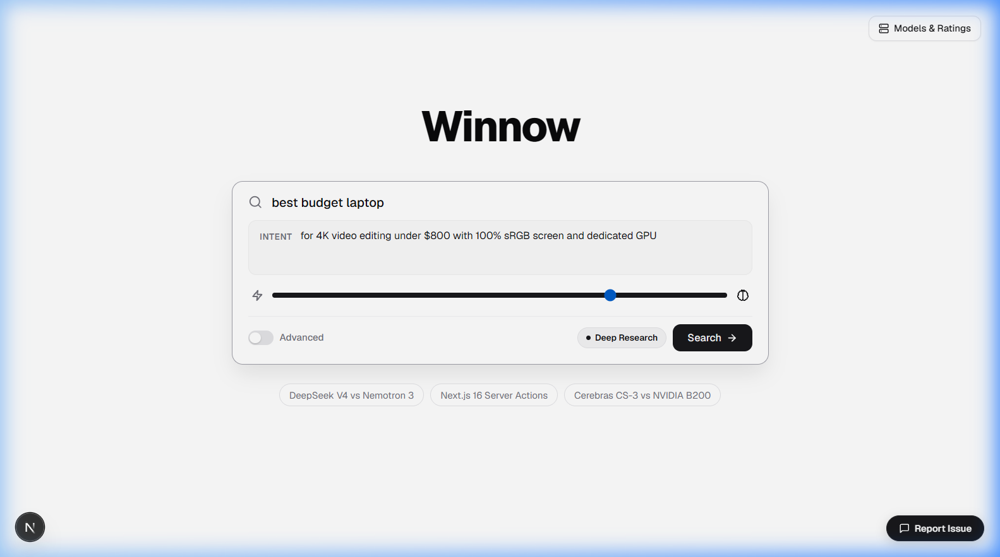
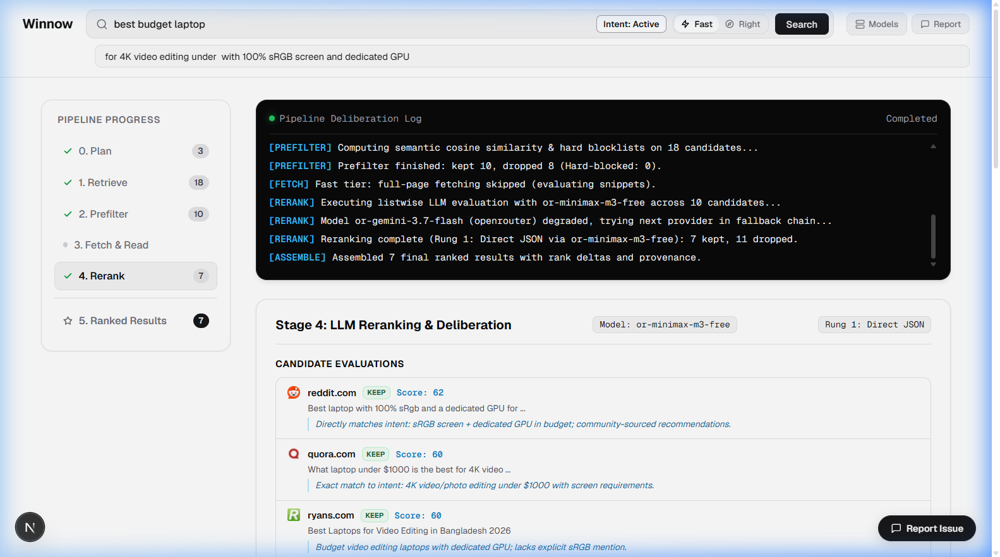
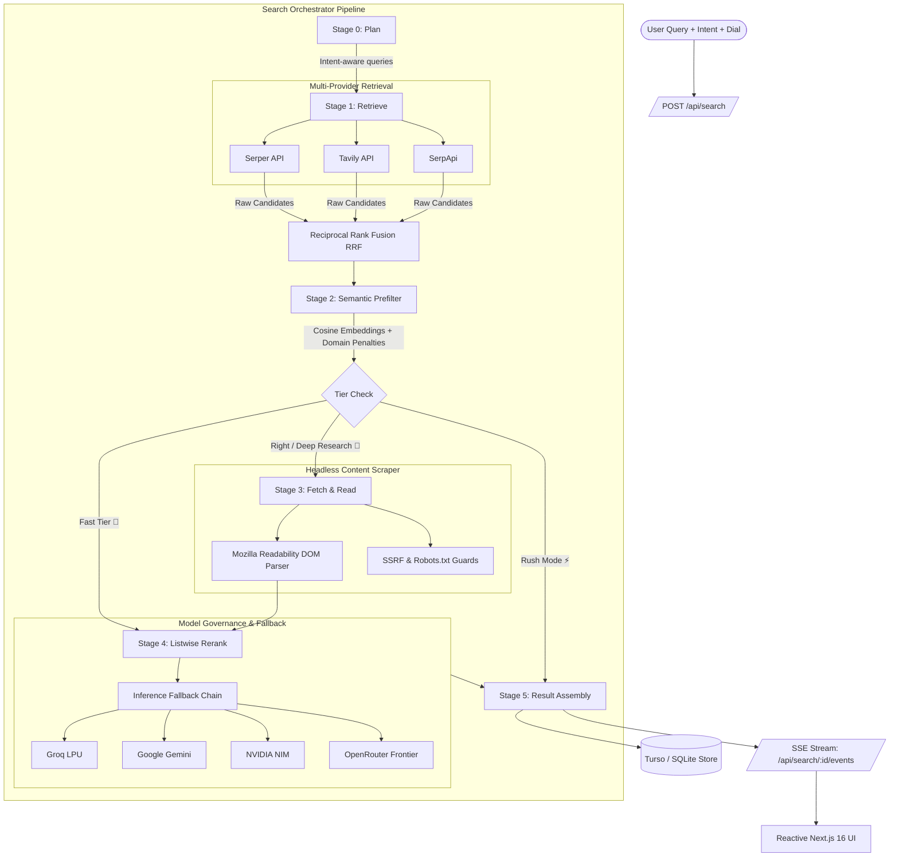
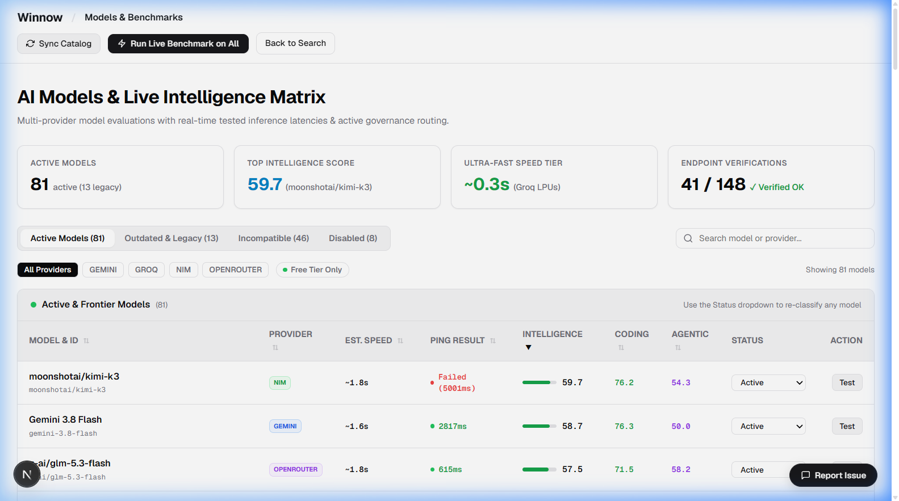
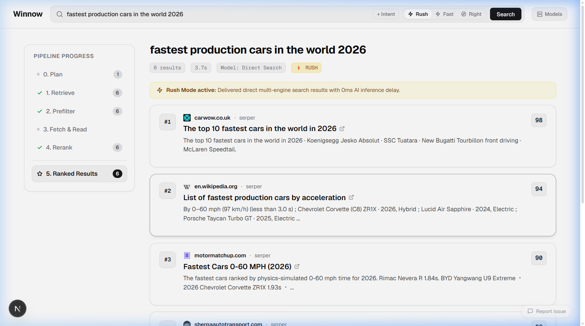

<div align="center">

# 🌾 Winnow
### *Separating the Signal from the Chaff.*

**Intent-aware autonomous web metasearch with listwise neural reranking.**

[](https://winnow.f01.dpdns.org)
[](https://nextjs.org)
[](https://www.typescriptlang.org)
[](https://turso.tech)
[](LICENSE)

<br />



</div>

---

## The Tragedy of the Modern Web

The internet was conceived as the greatest repository of human knowledge ever assembled. 

Today, searching it feels like sifting through an open-air landfill.

Type a query into a mainstream search engine, and you are rarely handed the best answer. You are handed the winner of an auction. The first page is an obstacle course of sponsored listings, synthetic SEO link farms, affiliate aggregators, and 2,500-word recipe preambles engineered to maximize ad impressions rather than deliver insight. 

So you do the exhausting labor yourself:
- Open fifteen tabs in the background.
- Skim past cookie banners, newsletter overlays, and affiliate disclosures.
- Discard the twelve pages that repeated the exact same generic talking points.
- Pray that the one human being who actually solved your problem is buried somewhere on page two.

We have accepted this cognitive tax as the price of using the internet.

**Winnow rejects that compromise.**

---

## What Winnow Does

The ancient agricultural act of **winnowing** separates heavy grain from light chaff by casting the harvest into the wind and letting the breeze blow the hollow husks away. 

Winnow does this for the web.

You supply a search query and, crucially, your **Intent** — what you are *actually* trying to accomplish, which is frequently not what fits in a search bar:

<div align="center">
<br />

<br />
</div>

1. **Massive Multi-Provider Fan-Out:** Your query is transformed into targeted sub-queries and fanned out in parallel across multiple independent search engines (Serper, Tavily, SerpApi) to retrieve raw candidates without single-vendor bias.
2. **Aggressive Semantic Pruning:** A semantic prefilter evaluates candidates against embedding vectors and domain hygiene blocklists, instantly discarding content farms, keyword bait, and irrelevant chaff.
3. **Deep Autonomous Reading:** In Deep Research mode, Winnow doesn't just read the two-line snippet Google gives you. It launches headless extractors, pulls down the full webpage DOM, strips tracking junk with Mozilla Readability, and reads the actual prose.
4. **Listwise Neural Deliberation:** Frontier intelligence models read the entire candidate pool simultaneously, judging each page strictly against your query **and** your intent.
5. **Truthful, Annotated Delivery:** You receive a clean, ranked manifest where every single result contains domain favicons, rank delta provenance, and an explicit **AI Rationale** explaining exactly why this page earned its place.

---

### The Power of Intent

Traditional search engines treat your query as a bag of keywords. Winnow treats it as the start of a deliberation.

Consider searching for:
> **Query:** `best budget laptop`

| Platform | What You Receive |
| :--- | :--- |
| **Traditional Search** | 10 identical affiliate listicles published last week with affiliate buy buttons, recommending whatever laptop pays the highest referral commission. |
| **Winnow** *(No Intent)* | High-signal, consensus reviews and real user teardowns. |
| **Winnow** *(Intent: `for 4K video editing under $800 with 100% sRGB screen and dedicated GPU`)* | **A completely different universe of results.** Generic budget laptops are purged. The #1 spot goes to an authentic community thread specifically validating thermal throttling, color gamut, and GPU rendering under $800. |

Change the intent, and the exact same query delivers a completely restructured reality.

---

## One Dial: From Reflex to Obsession

Speed on the web is usually treated as a static constraint. In Winnow, speed is an intentional spectrum:

<div align="center">
<br />

```
  [⚡ RUSH (0%)] ━━━━━━━━ [🚀 FAST TIER] ━━━━━━━━━━━━━━━━━━━●━━━━━━━━━ [🧠 DEEP RESEARCH]
   Sub-second (<500ms)      ~1.2s Latency                     ~73%              ~18.5s Latency
   Zero AI Inference Delay  High-speed LPUs (Groq)                             Full Page Scraping & Readability
   Direct Multi-Engine RRF  Cosine Semantic Prefilter                           Frontier Model Deliberation
```

<br />
</div>

- **0% — ⚡ Rush Mode (<500ms):** Pure reflex. When you need facts immediately without AI inference overhead, Winnow queries multi-engine search APIs in parallel and fuses candidates directly using Reciprocal Rank Fusion (RRF). Zero LLM latency, zero fluff, instant Google speed.
- **1%–74% — 🚀 Fast Tier (~1–3s):** Powered by ultra-low-latency LPU inference (Groq, Cerebras). Winnow rapidly evaluates titles, snippets, and semantic embeddings to return verified, ranked results with AI rationales before you can reach for another tab.
- **75%+ — 🧠 Deep Research ("Brainiac Mode"):** The AI stops skimming. It fetches the full text of candidate pages, strips the ads, reads thousands of words of technical prose with Mozilla Readability, and cross-examines the candidates in a listwise neural deliberation.

> **The Philosophy:** If an answer exists on the public internet, and there is even one forgotten page or discussion forum serving it, **Winnow will hunt it down, verify it, and hand it to you.**

---

## Truthful Architecture: No Fake Spinners

Most AI products show an animated pulse and hide what they are doing. Winnow treats you as a peer engineer.

The **Winnow Rail** visualizes candidate flow in real time across all 6 stages (`18 → 10 → 7`):

<div align="center">
<br />

<br />
</div>

- **Uncluttered Results Screen:** The primary search results view is completely clean and distraction-free — delivering high-signal ranked links, domain favicons, and AI rationales directly below your query without terminal noise.
- **Deep Stage Auditing & Deliberation:** Click into any pipeline stage on the left rail (Plan, Retrieve, Prefilter, Fetch & Read, Rerank) to inspect real-time pipeline deliberation logs, exact XML candidate manifests, cosine distance scores, and raw model output.
- **Inspect Chaff:** A collapsible drawer revealing every rejected site and the exact reason it was pruned (e.g. *hard blocklist*, *semantic threshold fail*, *model verdict: reject*).

---

<br />

```
================================================================================
                               TECHNICAL SPEC
                   Everything below is for engineers,
                   contributors, and self-hosters.
================================================================================
```

<br />

---

## System Architecture

Winnow is engineered with **Zero Python**. It is built natively on TypeScript and Next.js 16 (App Router) with Web Streams, Server-Sent Events (SSE), and edge-compatible SQLite/LibSQL storage.



---

## The 6-Stage Execution Engine

### Stage 0: Plan & Formulation
- Deconstructs raw user queries into intent-aware sub-queries using zero-shot reasoning.
- Formulates query expansions and negative constraints (e.g., `-site:pinterest.com`, `site:github.com`).
- Emits real-time `plan_done` SSE event with interpretation telemetry.

### Stage 1: Multi-Engine Retrieval & Fusion
- Dispatches parallel HTTP requests to configured search APIs (`Serper`, `Tavily`, `SerpApi`).
- Normalizes disparate vendor payloads into canonical `Candidate` structures.
- Merges candidate sets using **Reciprocal Rank Fusion (RRF)**:
  $$\text{RRF Score}(d) = \sum_{p \in \text{Providers}} \frac{1}{k + r_p(d)} \quad (k = 60)$$

### Stage 2: Semantic Prefilter & Blocklist Guard
- Projects candidates into embedding space to calculate cosine similarity against query + intent vectors.
- Enforces strict domain hygiene rules: removes known MFA (Made For Advertising) domains, affiliate farms, and clickbait scrapers.
- Retains top candidate cohort (typically top 10–18) while logging rejected entries as **Chaff**.

### Stage 3: Fetch & Read (Deep Research Tier)
- Headless HTTP fetch with strict 3-second abort controllers and SSRF IP range blocklists (rejects `127.0.0.1`, `10.0.0.0/8`, `169.254.0.0/16`).
- Cleans and extracts core article text using `@mozilla/readability` and `jsdom`.
- Checks `robots.txt` compliance, caches sanitized article bodies in SQLite, and truncates to model context budgets.

### Stage 4: Listwise Neural Reranking
- Rather than scoring pages independently (pointwise), Winnow constructs a unified XML manifest presenting all candidates simultaneously to the language model.
- The model evaluates cross-candidate trade-offs, relevance depth, author expertise, and adherence to user intent.
- **3-Tier Parse Ladder Resilience:**
  1. *Rung 1:* Direct structured JSON response.
  2. *Rung 2:* Markdown fenced codeblock extraction (` ```json `).
  3. *Rung 3:* Regex heuristic recovery for partial or truncated stream responses.
- Automated fallback routing: if a provider rate-limits (HTTP 429) or fails, the orchestrator immediately falls over to the next provider in the declared chain.
- *(Note: In **Rush Mode**, Stages 0, 2, 3, and 4 are dynamically bypassed to stream multi-engine candidates directly without LLM delay).*

### Stage 5: Assembly & Provenance
- Calculates final rank deltas ($\Delta \text{Rank} = \text{Rank}_{\text{raw}} - \text{Rank}_{\text{final}}$).
- Formats AI rationales, tags pages with read badges (`PAGE READ`), and records full audit traces.
- Emits final results over SSE and permanently persists the trace in Turso DB.

---

## Live Intelligence & Governance Matrix

Winnow does not hardcode static models. It features a live benchmark engine at `/models`:

<div align="center">
<br />

<br />
</div>

- **Dynamic Metric Synchronization:** Automatically pulls intelligence scores, coding benchmarks, and agentic indices from frontier evaluation datasets.
- **Live Latency Ping Matrix:** Automated background health checks ping inference providers every 4 hours. Models exceeding latency thresholds (>3000ms) or returning error codes are automatically degraded in the fallback chain.
- **Provider Governance:** Filter, test, and re-classify models on the fly across Groq, Google Gemini, NVIDIA NIM, and OpenRouter.

---

## ⚡ Rush Mode: Google Speed, 0s AI Overhead

Not every search requires deep cognitive deliberation. Sometimes you just need answers right now.

Winnow provides **Rush Mode** for sub-second, direct multi-engine retrieval:
- **0ms Instant Navigation:** Clicking Search navigates immediately using client-generated IDs with zero network blocking.
- **Bypasses LLM Inference:** Skips Stage 0 planning, Stage 2 semantic embedding, Stage 3 scraping, and Stage 4 LLM reranking.
- **RRF Reciprocal Rank Fusion:** Multi-engine search APIs are queried in parallel (~200ms) and fused directly into clean, ranked result cards.
- **Instant Toggle:** Slide the intelligence volume dial to **0%** or click `⚡ Rush` in the discrete tier switcher.
- **Pristine Result Cards:** Suppresses speculative AI rationale boxes to give you an uncluttered, fast search experience.

<div align="center">
<br />

<br />
</div>

---

## Built-In 10/10 Issue & Diagnostic Engine

Winnow includes an autonomous, self-contained diagnostic reporting system:

- **Client Error Ring Buffer:** Automatically captures unhandled exceptions, runtime warnings, and failed promises with stack traces, file sources, and line numbers.
- **Multi-Level Screenshot Engine:** High-res canvas export with cross-origin font protection (`skipFonts: true`), document fallback, and automatic asset hosting.
- **Direct GitHub Synchronization:** One click packages the user's description, screen capture, network stats (4G/WiFi, RTT, Downlink), hardware metrics (viewport, orientation, DPR), and the complete 6-stage pipeline trace directly into structured GitHub Issues.

---

## Declarative Configuration (`config/`)

Configure search and inference engines without writing a single line of TypeScript:

- **`config/providers.yaml`**: Search APIs, weights, timeouts, and result limits.
- **`config/inference.yaml`**: LLM endpoints, temperature, context limits, reasoning settings, and fallback ladders.
- **`config/winnow.yaml`**: Tier thresholds, semantic prefilter cutoffs, blocklists, cache TTLs, and RRF constants.

```yaml
# Example excerpt: config/winnow.yaml
tiers:
  rush:
    providers: [serper]
    retrieve_count: 10
    fetch_enabled: false
    rerank_mode: none
    deadline_ms: 3000

  fast:
    providers: [serper]
    retrieve_count: 15
    fetch_enabled: false
    rerank_mode: listwise
    deadline_ms: 10000

  right:
    providers: [serper, tavily]
    retrieve_count: 24
    fetch_enabled: true
    fetch_max: 10
    rerank_mode: listwise
    deadline_ms: 30000
```

```yaml
# Example excerpt: config/inference.yaml
fast_tier:
  primary:
    provider: groq
    model: llama-3.3-70b-versatile
  fallback_chain:
    - provider: gemini
      model: gemini-2.5-flash
    - provider: openrouter
      model: deepseek/deepseek-chat

right_tier:
  primary:
    provider: gemini
    model: gemini-2.5-pro
  fallback_chain:
    - provider: nvidia
      model: meta/llama-3.3-70b-instruct
    - provider: openrouter
      model: qwen/qwen-2.5-72b-instruct
```

---

## Quickstart & Installation

### Prerequisites
- Node.js 20+
- At least one Search API Key (`SERPER_KEY`, `TAVILY_KEY`, or `SERPAPI_KEY`)
- At least one Inference API Key (`GROQ_KEY`, `GEMINI_AI_STUDIO_KEY`, `NVIDIA_NIM_API_KEY`, or `OPEN_ROUTER_API_KEY`)

### 1. Clone & Install
```bash
git clone https://github.com/1719pankaj/Winnow.git
cd Winnow
npm install
```

### 2. Configure Environment
Copy `.env.example` to `.env`:
```bash
cp .env.example .env
```

Add your keys to `.env`:
```env
# Search Providers (At least one)
SERPER_KEY=your_serper_key_here
TAVILY_KEY=your_tavily_key_here
SERPAPI_KEY=your_serpapi_key_here

# Inference Providers (At least one)
GROQ_KEY=your_groq_key_here
GEMINI_AI_STUDIO_KEY=your_gemini_key_here
NVIDIA_NIM_API_KEY=your_nvidia_nim_key_here
OPEN_ROUTER_API_KEY=your_openrouter_key_here

# Storage (Optional - Defaults to local SQLite file:winnow.db)
TURSO_DATABASE_URL=
TURSO_AUTH_TOKEN=

# Issue Reporter (Optional)
GITHUB_TOKEN=your_personal_access_token
GITHUB_REPO=1719pankaj/Winnow
```

### 3. Run Self-Check Verification
Validate your configuration, API connections, and database schemas:
```bash
npx tsx scripts/run_self_check.ts
```

### 4. Start Development Server
```bash
npm run dev
```
Open [http://localhost:3000](http://localhost:3000) in your browser.

---

## Production Deployment (Vercel + Turso)

1. Push your repository to GitHub.
2. Import the project into **Vercel**.
3. Under **Project Settings → Environment Variables**, add your API keys from `.env`.
4. *(Recommended for distributed persistence)* Create a free database at [Turso](https://turso.tech) and set:
   - `TURSO_DATABASE_URL`
   - `TURSO_AUTH_TOKEN`
5. Deploy. Cold starts are under 250ms with zero Python runtime overhead.

---

## License

Distributed under the MIT License. See [`LICENSE`](LICENSE) for more information.

<div align="center">
<br />
<sub>Built with purpose. Winnow separates what matters from what merely ranks.</sub>
</div>
